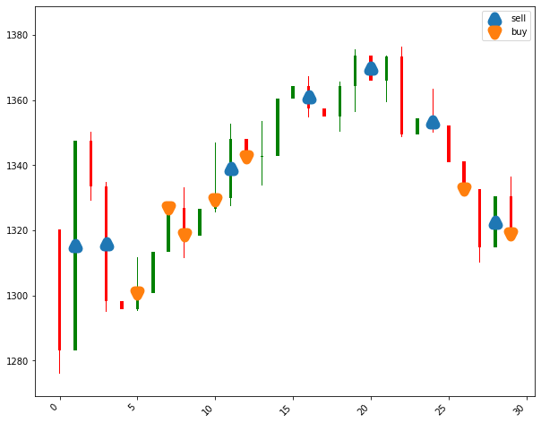

# RL agent for trading

The repository implements the idea of RLHF in the stock market. 

* Observation : previous timesteps of stock closing values (normalized between 0 to 1)

* Action : {Buy, Sell, Hold}

* Reward = Profit amount (normalized between 0 to 1)
## Step 1: Train the policy
    * Simple DQN Model
    * Rewards is Profit made by the model

## Step 2: Train the Reward model
    * For every State (observation), we assign a reward of 1 for action choosen by the expert and other 2 action gets 0 reward.
    *  Train the reward model with this dataset.

## Step 3: RL Use Human Feedback

    * Load the Policy trained from Step 1, use the reward model trained from Step 2, 
    and new reward is the (profit + reward_model)
    * Improvise the model with the reward model learnt from Human feedback. 

    

## TODO

1) Simple DQN
    
    * Agent (MLP, 1D Conv, RNN (LSTM, GRU, Transformer))
        
        [ ] MLP 
        
        [ ] 1D Conv

        [ ] LSTM, GRU

        [ ] Transformer 

    * ENV (Dataset sample SBIN data for 5 -6 years)
    * DQN Implementation

        * Action : Buy, Sell, Hold
        * Data Loader

Check the working of this model 

update reward with negative values 

update the observation to include the complete OHLCV + inventory